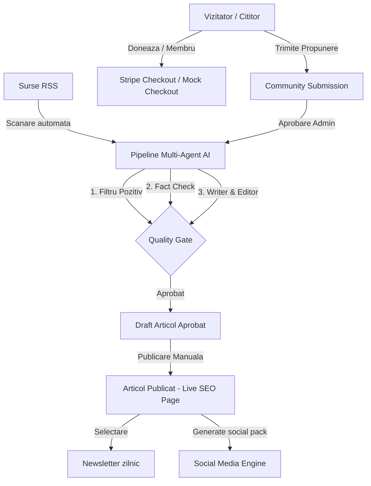

# Arhitectură Sistem: Positive News Agency

Aplicația este un produs fullstack construit folosind standardele moderne Next.js și o bază de date SQLite locală.

---

## 1. Stack Tehnologic
* **Framework**: Next.js 15 (React 19) cu rute App Router.
* **Redactare & Logică**: Server Actions pentru prelucrarea formularelor și a acțiunilor de administrare.
* **Bază de date**: SQLite, accesată prin intermediul Prisma ORM.
* **Stil**: Tailwind CSS v3 pentru o interfață mobile-first rapidă și curată.
* **AI Engine**: Integrare API modulară (OpenAI, Gemini, Anthropic, DeepSeek) cu sandbox local (`MODEL_PROVIDER="mock"`).

---

## 2. Structura Directoarelor
* `/app`: Paginile publice, portalul de admin, formularele de autentificare și rutele API (Stripe Webhook).
* `/components`: Componente reutilizabile (teme, tabele de filtrare, carduri articole, formulare newsletter).
* `/services`: Serviciile nucleu ale aplicației (analiză propuneri, gestiune newslettere, plăți, logare analytics).
* `/agents`: Agenții AI specializați (Positive Filter, Fact-Check, Research, Writer, Editor, SEO/Social, Quality Gate) și routerul de modele.
* `/lib`: Utilitare de autentificare, helpers, constante de sistem și clientul Prisma.
* `/docs`: Fișiere de documentație tehnică și editorială.
* `/prisma`: Schema bazei de date și scripturile de seed.
